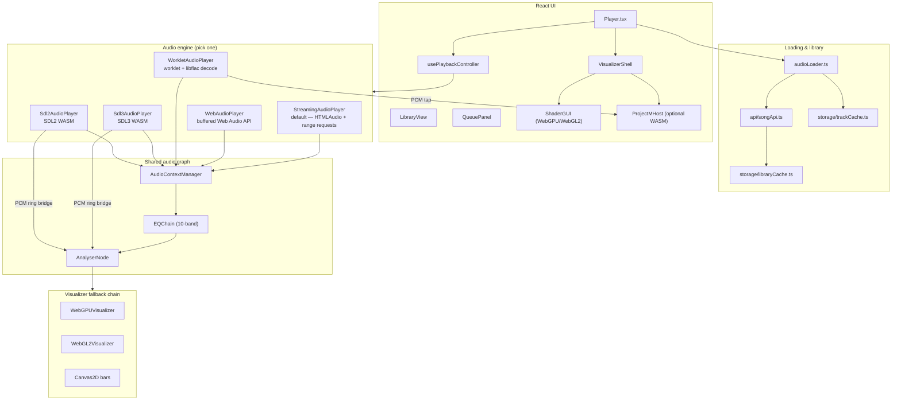

# FLAC Player Architecture

Last updated: July 2026

## System overview

The app is a React/TypeScript single-page player with a **five-backend audio engine**, **three-tier GPU visualizer fallback**, optional **projectM Milkdrop host**, and a **FastAPI library backend** (production default: `storage.noahcohn.com`).



## Audio data flow

### Library track (typical path)

```
User selects track in LibraryView / QueuePanel
    ↓
Player.tsx → usePlaybackController → createAudioBackend()
    ↓
GET https://storage.noahcohn.com/api/songs  (or REACT_APP_API_URL)
    ↓
Each song.url is an absolute https:// URL to the audio file
    ↓
createAudioBackend(outputMode) → one of five players
    ↓
AudioContextManager (shared context, EQ chain, analyser, volume)
    ↓
AnalyserNode → VisualizerShell → WebGPU / WebGL2 / Canvas2D / projectM
    ↓
Destination → speakers
```

### Buffered decode path (Web Audio, Worklet, SDL)

```
fetch(url) → ArrayBuffer
    ↓
flacDecoder.ts / audioDecoder.ts / flacDecoderWorker.ts
    ↓
AudioBuffer (or streaming chunks into worklet ring buffer)
    ↓
Backend-specific playback nodes
```

### Streaming path (default)

```
loadFromURL(url) → HTMLAudioElement.src = url
    ↓
Browser HTTP range requests (Accept-Ranges on CDN/nginx)
    ↓
MediaElementAudioSourceNode → GainNode → AudioContextManager
    ↓
Optional 3s crossfade via second <audio> element
```

No full-file download before playback starts. Requires CORS + `Accept-Ranges` on the audio host.

## Five audio backends

| Mode | Module | Load model | Best for |
|------|--------|------------|----------|
| `streaming` (default) | `audio/backends/StreamingAudioPlayer.ts` | URL → `<audio>` | Large library, instant start, crossfade |
| `web-audio` | `audio/backends/WebAudioPlayer.ts` | Full fetch + decode | Simple buffered playback, debugging |
| `worklet` | `audio/backends/WorkletAudioPlayer.ts` | Fetch/decode → worklet ring | Low latency, projectM PCM tap, EQ |
| `sdl` | `audio/backends/Sdl3AudioPlayer.ts` | Full fetch → WASM SDL3 | Experimental WASM output path |
| `sdl2` | `audio/backends/Sdl2AudioPlayer.ts` | Full fetch → WASM SDL2 | Same, SDL2 + AudioWorklet glue |

Backend factory: `src/audio/createAudioBackend.ts` (dynamic `import()` — WASM chunks load lazily).

Shared lifecycle guards (destroyed checks, volume/ReplayGain, state callbacks) live in `src/audio/backends/BaseAudioBackend.ts`. Playback lifecycle and queue advance are owned by `src/hooks/usePlaybackController.ts`; `Player.tsx` composes hooks + views only.

See [AUDIO_BACKENDS.md](./AUDIO_BACKENDS.md) for selection guidance.

## Visualizer stack

### Aesthetic modes (`VisualizerShell`)

| Mode | URL / storage | GPU use |
|------|---------------|---------|
| ShaderGUI | `?aesthetic=shadergui` (default) | WebGPU or WebGL2 |
| projectM | `?aesthetic=projectm` | projectM WASM only; ShaderGUI controls-only |
| Split | `?aesthetic=split` | ShaderGUI lite (WebGL2) + projectM |

### Renderer fallback (`src/visuals/rendererSelection.ts`)

```
WebGPU → WebGL2 → Canvas2D
```

Override: `?visualizer=webgl2`, `localStorage`, or `window.DEBUG_VISUALIZER`.

Layout + palette constants for both WGSL and GLSL live in `src/visuals/waveformContract.ts`. `Alt+D` debug modes work on WebGPU and WebGL2.

### PCM to projectM

```
AudioWorkletPlayer.setPCMCallback()
    ↓
createProjectMPCMFeed() in projectMBridge.ts
    ↓
In-app ProjectMHost OR postMessage / BroadcastChannel('projectm-audio')
```

## Shared audio infrastructure

### AudioContextManager (`src/audio/AudioContextManager.ts`)

- Single shared `AudioContext`
- 10-band EQ via `EQChain.ts`
- `connectInput()` / `connectVisualizerFeed()` routing
- SDL backends mute Web Audio destination while WASM owns speakers; PCM is tapped back for the analyser

### SDL PCM bridge (`src/audio/SdlPcmBridge.ts`)

Lock-free ring in C++ (`src/sdl/pcm_ring.h`) → AudioWorklet tap → real `AnalyserNode` data for SDL3/SDL2.

## Library & storage (client)

| Module | Role |
|--------|------|
| `api/songApi.ts` | REST client for songs, tags, share, upload, MusicBrainz |
| `storage/libraryCache.ts` | TTL cache for `/api/songs` responses |
| `storage/trackCache.ts` | Cache API offline track storage (LRU, 500 MB default) |
| `storage/queueStorage.ts` | Persisted queue + repeat/shuffle |
| `components/OfflineCache.tsx` | Per-track download / evict UI |

Production API: **`https://storage.noahcohn.com`** (`REACT_APP_API_URL`).

## Backend API (FastAPI)

Local/dev: `app.py` on port 7860. Production library and static audio files are served from `storage.noahcohn.com`.

Key endpoints: `GET /api/songs`, `POST /api/songs/{id}/play`, `POST /api/share`, `GET /api/share/{id}`. Full contract: [API.md](./API.md).

## Build & WASM artifacts

| Artifact | Build command | Committed in `public/` |
|----------|---------------|------------------------|
| SDL3 | `npm run build:wasm:sdl3` or `bash src/sdl/build.sh` | `sdl-audio.js`, `sdl-audio.wasm` |
| SDL2 | `npm run build:wasm:sdl2` or `bash src/sdl/build_sdl2.sh` | `sdl2-audio.js`, `sdl2-audio.wasm` |
| projectM | `npm run build:projectm` | `projectm/projectm-host.*` (optional) |

CI runs `npm run verify:wasm` against `public/wasm-source.sha256`. Production webpack uses `--env skipWasm=true` and copies prebuilt binaries.

## Cross-origin isolation

Required for AudioWorklet, SharedArrayBuffer, SDL pthread builds, and projectM WASM:

```
Cross-Origin-Opener-Policy: same-origin
Cross-Origin-Embedder-Policy: require-corp
```

Configured in `webpack.config.js` (dev), `netlify.toml`, and `vercel.json`.

## Testing

```bash
npm run test:decoder   # libflac decode unit test
npm run test:e2e       # Playwright smoke tests (tests/smoke.spec.ts)
npm run typecheck && npm run lint
```

## Listening rooms (planned — #185)

Static playlist share (`POST /api/share`, `/playlist/{id}`) loads a track list once per client. **Synced listening rooms** add a host-authoritative WebSocket layer so guests follow the same track and playhead.

```
Host Player                    Signaling (WS)                 Guest Player(s)
    │  POST /api/rooms                                              │
    ├─ JOIN (host) ───────────────────────────────────────────────►│
    ├─ PLAY / PAUSE / SEEK / QUEUE_UPDATE ─────────────────────────►│ apply + drift-correct
    └─ HEARTBEAT (5s) ───────────────────────────────────────────►│
```

MVP: **streaming backend only**, `HTMLAudioElement.currentTime` as clock, target ≤ 500 ms drift. Full protocol, API contract, and foundation refactor hooks: [LISTENING_ROOMS.md](./LISTENING_ROOMS.md).

## Related docs

- [AUDIO_BACKENDS.md](./AUDIO_BACKENDS.md) — backend selection guide
- [API.md](./API.md) — REST + projectM embed contract
- [LISTENING_ROOMS.md](./LISTENING_ROOMS.md) — synced listening rooms design (#185)
- [DEVELOPER_CONTEXT.md](./DEVELOPER_CONTEXT.md) — complexity hotspots for agents
- [ROADMAP.md](./ROADMAP.md) — open GitHub issues #166–#174
