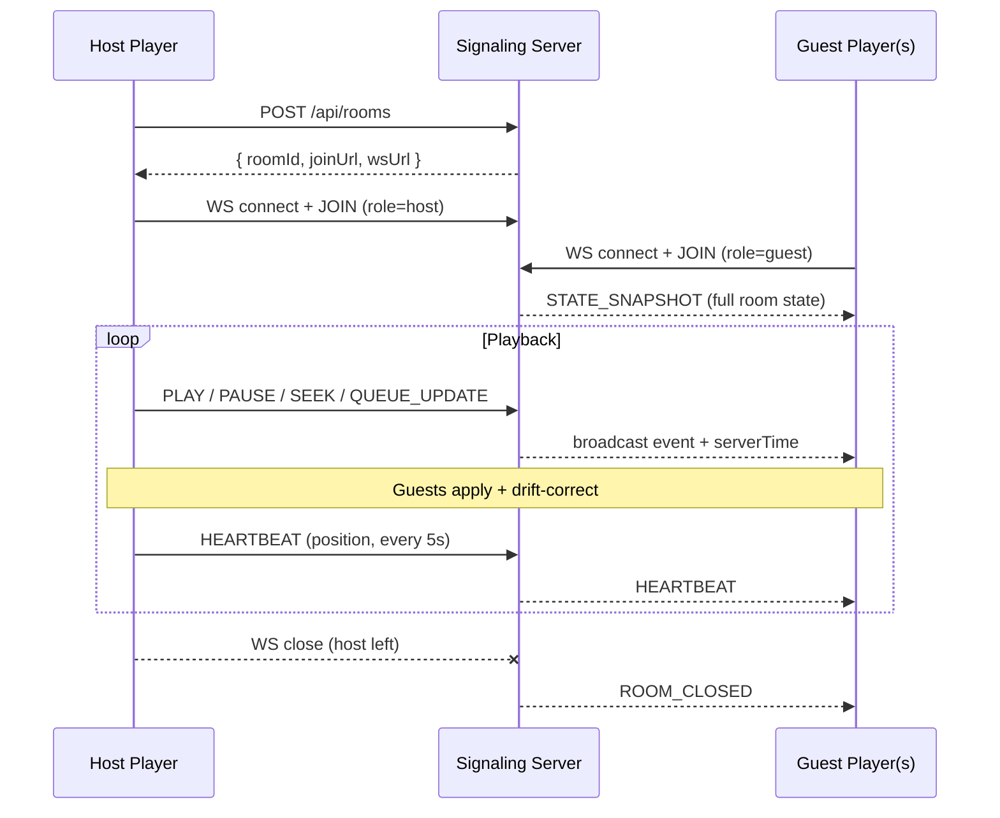

# Synced Listening Rooms — Design Document

**Status:** Design (pre-implementation)  
**Tracking:** [#185](https://github.com/ford442/flac_player/issues/185)  
**Last updated:** July 2026

## Summary

Playlist sharing today is **static**: `POST /api/share` returns a track list; recipients load it independently with no shared playhead. This document specifies **"Listen together"** mode: a host creates a room, guests join via link, and everyone hears the same track at approximately the same position (target **≤ 500 ms** drift over a 10-minute session).

MVP uses a **host-authoritative** model over **WebSocket**, the **streaming** audio backend only, and `HTMLAudioElement.currentTime` as the playback clock.

---

## Problem statement

| Today (`/api/share`) | Target (listening rooms) |
|----------------------|--------------------------|
| One-time snapshot of `track_ids` | Live, mutable room state |
| Each client plays independently | Host clock is source of truth |
| No play/pause/seek propagation | Events propagate in &lt; 1 s |
| Expires after `expires_in_days` | Room closes when host disconnects |

Existing building blocks:

- **Queue state:** `src/storage/queueStorage.ts` (`tracks`, `currentIndex`, `shuffle`, `repeat`)
- **Playback state:** `PlayerUIState` / `AudioPlaybackState` (`isPlaying`, `currentTime`, `duration`)
- **Backend controls:** `AudioBackend.play()`, `.pause()`, `.seek()`, `.getState()` (`src/types/audio.ts`)
- **Share UX:** `generateShareLink()` in `Player.tsx` → `createShare()` in `src/api/songApi.ts`
- **Route:** `/playlist/{share_id}` loads a static list on mount (`Player.tsx` init effect)

---

## Goals and non-goals

### MVP acceptance criteria

- [ ] Two browser tabs stay within **500 ms** for a **10-minute** session
- [ ] Host **pause** propagates to guests within **1 s**
- [ ] Room **closes gracefully** when the host leaves (guests see ended state, can leave)
- [ ] Works with **production CORS** on `storage.noahcohn.com`

### Out of scope (MVP)

- Visualizer / analyser sync (local-only by design)
- SDL, worklet, or web-audio backends (streaming clock only)
- Guest DJ / permission levels (host-only control)
- WebRTC data channels (Phase 2)
- TinyURL integration for room links (Phase 2; reuse existing `url_shortener.py` pattern)

### Phase 2 (future)

- WebRTC data channel for sub-100 ms sync and lower server load
- Guest roles: listen-only vs co-DJ (seek/queue mutations)
- Optional TinyURL shortening for `joinUrl`
- Buffered-backend clock abstraction (worklet ring position, `AudioContext.currentTime` mapping)

---

## Architecture

### High-level flow



### Authority model

- **Host-authoritative:** only the host may emit control messages (`PLAY`, `PAUSE`, `SEEK`, `QUEUE_UPDATE`, `TRACK_CHANGE`). The server rejects control messages from guests in MVP.
- **Server timestamps:** every outbound message includes `serverTime` (ISO 8601 or Unix ms) so guests can estimate one-way latency and correct position.
- **Guest read-only:** guests apply state; they may show an **"Out of sync — Resync"** button that requests a fresh `STATE_SNAPSHOT` (not a seek request to the host in MVP).

Phase 2 adds `guest:seek_request` and host approval for co-DJ handoff.

---

## Server design

### Deployment targets

| Environment | REST | WebSocket | Notes |
|-------------|------|-----------|-------|
| Local prototype | `app.py` | `app.py` (`/ws/rooms/{id}`) | In-memory room map; good for dev |
| Production | `storage.noahcohn.com` | Same host, `wss://` | Requires nginx/WebSocket upgrade + CORS |

Prototype in `app.py` first; port contract to Contabo Storage Manager (`contabo_storage_manager/packages/python-bridge`) before production cutover.

### REST endpoints

#### `POST /api/rooms`

Create a room. Caller becomes host (validated via first WebSocket `JOIN` with matching `hostToken`).

**Request:**

```json
{
  "title": "Friday Night Mix",
  "track_ids": ["abc123", "def456"],
  "expires_in_minutes": 240
}
```

`track_ids` optional — host may start empty and populate via `QUEUE_UPDATE`.

**Response:**

```json
{
  "room_id": "xK9mP2nQ",
  "host_token": "secret-host-only-string",
  "join_url": "https://flac-player.example.com/room/xK9mP2nQ",
  "ws_url": "wss://storage.noahcohn.com/ws/rooms/xK9mP2nQ",
  "expires_at": "2026-07-22T14:30:00Z"
}
```

`host_token` is returned once; store in sessionStorage on the host tab. Never expose in `join_url`.

#### `GET /api/rooms/{room_id}`

Read-only room metadata for join page (title, track count, host present, expired). No playback state (that comes over WS).

#### `DELETE /api/rooms/{room_id}`

Host-only (requires `host_token` header). Explicit room teardown.

### WebSocket: `/ws/rooms/{room_id}`

**Connection:** `wss://{API_HOST}/ws/rooms/{room_id}`

**Query params:**

| Param | Required | Description |
|-------|----------|-------------|
| `role` | yes | `host` or `guest` |
| `host_token` | host only | From `POST /api/rooms` |
| `client_id` | no | Stable UUID for reconnect; server may resume guest slot |

**CORS / origin:** mirror existing REST policy (`CORS_ALLOWED_ORIGINS`). WebSocket handshake must allow production app origins (e.g. Netlify/Vercel/static host).

### Message envelope

All messages are JSON with a common envelope:

```json
{
  "type": "PLAY",
  "roomId": "xK9mP2nQ",
  "serverTime": 1721635200123,
  "payload": { }
}
```

### Message types (MVP)

| Type | Direction | Payload | Notes |
|------|-----------|---------|-------|
| `JOIN` | client → server | `{ role, hostToken?, clientId? }` | First message after connect |
| `JOINED` | server → client | `{ role, guestCount }` | Ack |
| `STATE_SNAPSHOT` | server → client | See [Room state](#room-state) | On join + on resync request |
| `PLAY` | host → server → all | `{ position, trackId }` | `position` = seconds |
| `PAUSE` | host → server → all | `{ position, trackId }` | |
| `SEEK` | host → server → all | `{ position, trackId }` | |
| `TRACK_CHANGE` | host → server → all | `{ trackId, position, trackIndex }` | New track loaded |
| `QUEUE_UPDATE` | host → server → all | `{ trackIds, currentIndex, shuffle, repeat }` | IDs only; clients resolve metadata |
| `HEARTBEAT` | host → server → all | `{ position, playing, trackId }` | Every 5 s + on idle |
| `RESYNC_REQUEST` | any → server | `{}` | Server replies with `STATE_SNAPSHOT` |
| `ROOM_CLOSED` | server → all | `{ reason }` | `host_left`, `expired`, `deleted` |
| `ERROR` | server → client | `{ code, message }` | |

### Room state

Canonical state object (in `STATE_SNAPSHOT` and server memory):

```typescript
interface ListeningRoomState {
  roomId: string;
  title: string;
  hostConnected: boolean;
  trackId: string | null;
  trackIndex: number;
  position: number;       // seconds
  playing: boolean;
  queue: {
    trackIds: string[];
    currentIndex: number;
    shuffle: boolean;
    repeat: 'off' | 'one' | 'all';
  };
  revision: number;       // monotonic; ignore stale events
}
```

Server stores rooms in memory (MVP). Production may add Redis with TTL keyed to `expires_at`.

### Host lifecycle

1. Host opens WebSocket with `role=host` + `host_token`.
2. On host disconnect (close code ≠ intentional leave): start **grace period** (e.g. 30 s). If host reconnects with same `host_token`, resume. Otherwise broadcast `ROOM_CLOSED` `{ reason: "host_left" }` and delete room.
3. Guest connections receive `ROOM_CLOSED` and UI transitions to "Session ended".

### Rate limits (production)

- Max **20 guests** per room (configurable)
- Max **2 control messages/s** per host (burst OK for seek scrubbing)
- `HEARTBEAT` minimum interval **3 s**

---

## Client design

### Route

Add `/room/{room_id}` (parallel to `/playlist/{share_id}`):

- `App.tsx`: treat `/room/:id` like shared playlist (full-screen player, no marketing header)
- Join URL from API: `{APP_ORIGIN}/room/{room_id}`

Query `?host=1` is **not** used for security; host identity is `host_token` in sessionStorage only.

### Module layout (proposed)

```
src/
  listening/
    types.ts              # ListeningRoomState, WS message types
    roomApi.ts            # POST/GET /api/rooms
    roomProtocol.ts       # encode/decode, revision guards
    syncEngine.ts         # drift detection + apply corrections
    useListeningRoom.ts   # React hook
  components/
    ListeningRoomPanel.tsx  # host badge, guest count, copy link, resync, leave
```

Keep listening logic **out of** `Player.tsx`; wire room sync through **`usePlaybackController`** callbacks (foundation landed in [#193](https://github.com/ford442/flac_player/issues/193)) via the thin adapter interface below.

### `useListeningRoom` hook

```typescript
interface UseListeningRoomOptions {
  roomId: string | null;
  role: 'host' | 'guest' | null;
  hostToken?: string;
  /** Called when remote state should drive the player */
  onApplyState: (state: ListeningRoomState) => void;
  /** Poll local playback for host heartbeats */
  getLocalPlayback: () => {
    trackId: string | null;
    position: number;
    playing: boolean;
    queue: QueueState;
  };
  enabled: boolean;
}

interface UseListeningRoomResult {
  connected: boolean;
  isHost: boolean;
  guestCount: number;
  driftMs: number | null;
  outOfSync: boolean;
  roomClosedReason: string | null;
  createRoom: (opts: CreateRoomRequest) => Promise<CreateRoomResponse>;
  joinRoom: (roomId: string) => void;
  leaveRoom: () => void;
  requestResync: () => void;
  /** Host only: emit after local user actions */
  publishPlay: (position: number) => void;
  publishPause: (position: number) => void;
  publishSeek: (position: number) => void;
  publishQueueUpdate: (queue: QueueState) => void;
  publishTrackChange: (trackId: string, index: number, position: number) => void;
}
```

**Host wiring:** `usePlaybackController` (or a thin `useListeningRoomBridge` wrapper) calls `publish*` from existing handlers (`playTrack`, pause toggle, seek slider, queue mutations).

**Guest wiring:** `onApplyState` loads track if `trackId` changed, seeks if `|localPosition - remotePosition| > threshold`, play/pauses to match.

### Sync algorithm (streaming MVP)

**Clock source:** `StreamingAudioPlayer` on the **native `<audio>` path** only.

- MVP room mode sets `outputMode` to `streaming` and disables hi-fi FLAC worklet sub-path (or documents `getState().currentTime` from worklet as fallback — native path is simpler).
- Position: `audioElement.currentTime`
- Playing: `!audioElement.paused && !audioElement.ended`

**Drift correction (guest):**

```
DRIFT_THRESHOLD_MS = 250   // no correction
HARD_SYNC_THRESHOLD_MS = 500  // seek immediately

on HEARTBEAT or PLAY/PAUSE/SEEK:
  expectedPosition = payload.position + (now - serverTime) * (playing ? 1 : 0)
  drift = (localPosition - expectedPosition) * 1000

  if |drift| > HARD_SYNC_THRESHOLD_MS:
    seek(expectedPosition)
  else if |drift| > DRIFT_THRESHOLD_MS:
    // soft: nudge playbackRate briefly (1.02 or 0.98) for < 2s, then reset
```

**Periodic sync:** host emits `HEARTBEAT` every **5 s** and on every control event. Guests run drift correction on each.

**Latency budget:**

| Step | Target |
|------|--------|
| Host event → server | &lt; 50 ms |
| Server → guest | &lt; 50 ms |
| Guest apply (seek/play) | &lt; 100 ms |
| **Total (pause)** | **&lt; 1 s** (acceptance) |

### UI (MVP)

| Element | Host | Guest |
|---------|------|-------|
| Badge | "Hosting · N listening" | "Listening · synced" / "Out of sync" |
| Copy link | `join_url` (no token) | — |
| Resync | optional | button → `RESYNC_REQUEST` |
| Leave | ends room (confirm) | disconnect only |
| Output mode | locked to streaming | locked to streaming |

Entry point: **"Listen together"** next to existing share control in queue/settings (uses current queue as initial `track_ids`).

### Environment variables

| Variable | Purpose |
|----------|---------|
| `REACT_APP_API_URL` | REST base (existing) |
| `REACT_APP_WS_URL` | Optional WS override; default derive from API host (`https` → `wss`) |

Webpack `DefinePlugin`: add `REACT_APP_WS_URL` alongside existing `REACT_APP_*` keys.

---

## Integration with foundation refactors

Foundation work ([#176](https://github.com/ford442/flac_player/issues/176) / [#177](https://github.com/ford442/flac_player/issues/177), shipped as [#193](https://github.com/ford442/flac_player/issues/193)) is **complete**. Listening rooms ([#197](https://github.com/ford442/flac_player/issues/197)) can build on the extension points below.

### Backend consolidation (`src/audio/backends/`) — done

Add optional interface on `ConfigurableAudioBackend`:

```typescript
interface SyncClock {
  /** Seconds; same semantics as HTMLMediaElement.currentTime */
  getSyncPosition(): number;
  isSyncPlaying(): boolean;
}

interface ConfigurableAudioBackend extends AudioBackend {
  getSyncClock?(): SyncClock | null;  // null = room mode unsupported
}
```

MVP: implement only on `StreamingBackend` (native path). Other backends return `null`; UI shows "Listening rooms require streaming mode."

### Player decomposition — done (`usePlaybackController`)

**`usePlaybackController`** exposes stable callbacks for room sync:

| Callback | Room `publish*` |
|----------|-----------------|
| `onPlay` | `publishPlay` |
| `onPause` | `publishPause` |
| `onSeek` | `publishSeek` |
| `onTrackChange` | `publishTrackChange` |
| `onQueueChange` | `publishQueueUpdate` |

`useListeningRoom` mounts in a parent shell (`PlayerShell` or `App`), not inside ShaderGUI/visualizer code.

### #180 — Audio pipeline integration tests

Add harness cases:

- Mock WebSocket server replays `STATE_SNAPSHOT` → guest seek position
- Two-tab Playwright: host play/pause, assert guest state within 1 s
- 10-minute soak (CI nightly): assert drift &lt; 500 ms samples every 30 s

---

## Security and abuse

- `host_token`: 32+ byte random, required for host WS and `DELETE`
- Guests cannot seek or change queue (server-enforced)
- Room IDs: same entropy as share IDs (`URLShortener.generate_short_id`)
- No PII in room state; track IDs only
- Expire rooms by `expires_at`; sweep stale rooms on interval

---

## Operations checklist (production)

- [ ] nginx `proxy_set_header Upgrade` + `Connection "upgrade"` for `/ws/`
- [ ] `wss://` TLS on same cert as `storage.noahcohn.com`
- [ ] Add app origin to `CORS_ALLOWED_ORIGINS` if not wildcard
- [ ] Health: `GET /api/health` includes `rooms_active` count (optional)
- [ ] Monitor: WS connection count, room create rate, average guest count

---

## Migration from static share

Static share remains unchanged. Optional later: **"Share playlist"** vs **"Listen together"** toggle in share dialog.

| Action | Static share | Listening room |
|--------|--------------|----------------|
| API | `POST /api/share` | `POST /api/rooms` |
| Link | `/playlist/{id}` | `/room/{id}` |
| Data | `track_ids` snapshot | live state over WS |
| TinyURL | yes | Phase 2 |

---

## Implementation phases

### Phase 0 — This document

- [x] Capture protocol, state shape, sync algorithm
- [x] Define extension points for backend consolidation / playback controller / #180

### Phase 1 — MVP

1. `app.py` in-memory rooms + WebSocket endpoint
2. `src/listening/*` client modules + `useListeningRoom`
3. `/room/{id}` route + `ListeningRoomPanel` UI
4. Host/guest manual QA + Playwright two-tab test
5. Port endpoints to production bridge

### Phase 2 — Latency and permissions

- WebRTC data channel for sync metadata
- Co-DJ roles + `guest:seek_request`
- TinyURL for `join_url`
- Multi-backend `SyncClock`

---

## Related docs

- [API.md](./API.md) — REST catalog (room endpoints marked planned)
- [ARCHITECTURE.md](./ARCHITECTURE.md) — system diagram (listening layer)
- [ROADMAP.md](./ROADMAP.md) — #185 tracking
- [AUDIO_BACKENDS.md](./AUDIO_BACKENDS.md) — why streaming-only for MVP
