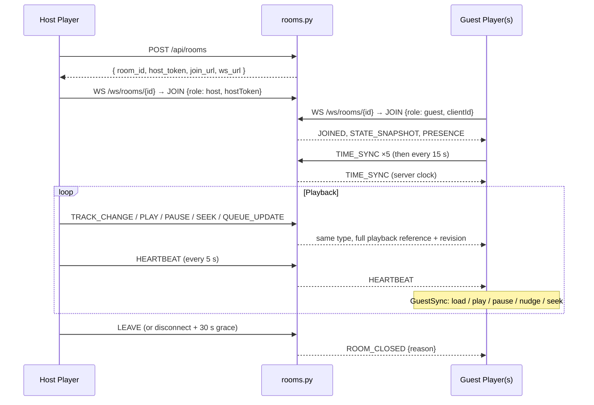

# Synced Listening Rooms

**Status:** Implemented (MVP) — prototype server in `app.py` / `rooms.py`; production bridge port pending  
**Tracking:** [#209](https://github.com/ford442/flac_player/issues/209) (design closed as #197)  
**Last updated:** October 2026

## Summary

Playlist sharing (`POST /api/share`) is **static**: recipients get a track list and play it independently. **Listen together** adds live rooms: a host creates a room, guests open a link, and everyone hears the same track at approximately the same position.

MVP: **host-authoritative** over **WebSocket**, **streaming backend only** (native `<audio>` path), clock = `HTMLAudioElement.currentTime` mapped onto an NTP-style estimate of the server clock.

| Today (`/api/share`) | Listening rooms |
|----------------------|-----------------|
| One-time snapshot of `track_ids` | Live, mutable room state |
| Each client plays independently | Host clock is source of truth |
| No play/pause/seek propagation | Events propagate in well under 1 s |
| Expires after `expires_in_days` | Room closes when the host leaves (30 s reconnect grace) |

---

## Acceptance (MVP)

Measured with two headless Chromium tabs against `app.py` on one machine (11-minute FLAC, 10-minute soak, 119 samples every 5 s):

- [x] Two browser tabs stay within **500 ms** for **10 minutes** — max |drift| 101 ms, typically 30–100 ms; after seek ≈ 115–180 ms, after a track change < 50 ms
- [x] Host **pause** propagates to guests within **1 s** — 19–36 ms (resume 35–50 ms) on localhost
- [x] Room **closes gracefully** when the host leaves — `End room` → guests see "The host ended the session"; tab close → after the grace period
- [ ] Works with **production CORS** on `storage.noahcohn.com` — needs the bridge port below (WebSocket origin check mirrors `CORS_ALLOWED_ORIGINS`)
- [x] Unit tests for drift correction and the room protocol (`tests/listeningSync.test.ts`, `tests/listeningRoom.test.ts`, `tests/test_rooms.py`)

Out of scope (MVP): visualizer/analyser sync, SDL / worklet / web-audio clocks, guest DJ permissions, WebRTC, TinyURL room links.

---

## Using it

1. Open the queue (fallback view) and click **🎧** (Listen together), or click **🎧 Listen together** in the full-screen player. The current queue (library tracks only) becomes the room queue.
2. The join link (`{app}/?room={id}`) is copied to the clipboard; the host tab's URL changes to the same link so a reload reclaims the room.
3. Guests open the link. If the browser blocks autoplay they see **▶ Start listening**; one click starts audio.
4. Host controls everything (play, pause, seek, next, queue edits). Guest transport buttons show a hint instead; **Resync** asks for a fresh snapshot.
5. **End room** (host) closes it for everyone; **Leave** (guest) disconnects and reloads the normal player.

While a room is active the backend is locked to **streaming** and the streaming backend is forced onto its **native `<audio>` path** (FLAC included); a host track already playing on the hi-fi/worklet path is reloaded natively at the same position.

---

## Architecture


```mermaid
sequenceDiagram
  participant Host as Host Player
  participant API as rooms.py
  participant Guest as Guest Player(s)

  Host->>API: POST /api/rooms
  API-->>Host: { room_id, host_token, join_url, ws_url }
  Host->>API: WS /ws/rooms/{id} → JOIN {role: host, hostToken}
  Guest->>API: WS /ws/rooms/{id} → JOIN {role: guest, clientId}
  API-->>Guest: JOINED, STATE_SNAPSHOT, PRESENCE
  Guest->>API: TIME_SYNC ×5 (then every 15 s)
  API-->>Guest: TIME_SYNC (server clock)

  loop Playback
    Host->>API: TRACK_CHANGE / PLAY / PAUSE / SEEK / QUEUE_UPDATE
    API-->>Guest: same type, full playback reference + revision
    Host->>API: HEARTBEAT (every 5 s)
    API-->>Guest: HEARTBEAT
    Note over Guest: GuestSync: load / play / pause / nudge / seek
  end

  Host->>API: LEAVE (or disconnect + 30 s grace)
  API-->>Guest: ROOM_CLOSED {reason}
```

### Authority model

- **Host-authoritative:** only the host may send `PLAY`, `PAUSE`, `SEEK`, `TRACK_CHANGE`, `QUEUE_UPDATE`, `HEARTBEAT`. Guests get `ERROR {code: "forbidden"}`.
- **Server-stamped:** every outbound envelope carries `serverTime` (Unix ms). Playback messages also carry `positionUpdatedAt` — the server-clock time at which the host *read* its position.
- **Guest read-only:** guests apply state; **Resync** sends `RESYNC_REQUEST` and gets a fresh `STATE_SNAPSHOT`.

---

## Server (`rooms.py`)

`create_rooms_router(manager, app_base_url=…, allowed_origins=…, public_ws_base_url=…)` returns a FastAPI `APIRouter`; `app.py` mounts it and runs `RoomManager.run_sweeper()` in its lifespan. Rooms live in process memory: **run one uvicorn worker** (or move `RoomManager` to Redis).

### REST

| Method | Path | Notes |
|--------|------|-------|
| `POST` | `/api/rooms` | Body `{ title?, track_ids?, expires_in_minutes? (5–1440, default 240) }` → `{ room_id, host_token, join_url, ws_url, expires_at }`. 429 after 10 creates / 10 min per client, 503 past `ROOM_MAX_ACTIVE` rooms. |
| `GET` | `/api/rooms/{room_id}` | `{ room_id, title, track_count, guest_count, host_connected, expires_at }`; 404 when missing/ended. |
| `DELETE` | `/api/rooms/{room_id}` | Header `X-Host-Token`; closes the room (`ROOM_CLOSED {reason: "deleted"}`). |
| `GET` | `/room/{room_id}` | Redirects to `/?room={room_id}` (when `app.py` serves the SPA). |

`host_token` (32 random bytes, URL-safe) is returned once; the client keeps it in **sessionStorage** only. Room ids use `URLShortener.generate_short_id(10)`, like share ids. The client builds its own join link from `window.location`; `join_url` / `ws_url` in the response are informational.

### WebSocket `/ws/rooms/{room_id}`

- **Origin check:** the handshake is rejected (close `1008`) unless `Origin` is in `CORS_ALLOWED_ORIGINS` (`*` allows all). CORSMiddleware does not cover WebSockets.
- **First message must be `JOIN`** within 10 s: `{ role: "host" | "guest", hostToken?, clientId? }` (query params `role` / `host_token` / `client_id` are accepted as fallbacks). A guest reconnecting with the same `clientId` replaces its old socket instead of taking a new slot.
- **Envelope:** `{ type, roomId, serverTime, revision?, payload }`.

| Type | Direction | Payload |
|------|-----------|---------|
| `JOIN` | client → server | `{ role, hostToken?, clientId? }` |
| `JOINED` | server → client | `{ role, clientId, guestCount, hostConnected }` |
| `STATE_SNAPSHOT` | server → client | `ListeningRoomState` (on join and on `RESYNC_REQUEST`) |
| `PLAY` / `PAUSE` / `SEEK` / `TRACK_CHANGE` / `HEARTBEAT` | host → server | `{ trackId, trackIndex, position, playing, rate, sampledAt }` |
| same | server → guests | full `PlaybackReference` + envelope `revision` |
| `QUEUE_UPDATE` | host → server → guests | `{ trackIds, currentIndex, shuffle, repeat }` |
| `PRESENCE` | server → all | `{ guestCount, hostConnected }` on every join/leave |
| `TIME_SYNC` | client → server → client | `{ t0 }` echoed; reply `serverTime` is the server clock |
| `RESYNC_REQUEST` | any → server | `{}` → `STATE_SNAPSHOT` |
| `LEAVE` | client → server | `{}`; from the host it ends the room immediately |
| `ROOM_CLOSED` | server → all | `{ reason: host_left | expired | deleted | server_shutdown }` |
| `ERROR` | server → client | `{ code, message }` (`forbidden`, `room_not_found`, `room_full`, `rate_limited`, `invalid_payload`, …) |

Close codes (no client reconnect): `4000` room ended, `4001` replaced by a newer connection, `4403` forbidden / bad JOIN, `4404` room not found, `4429` room full, `1008` origin rejected.

### Room state

```typescript
interface PlaybackReference {
  trackId: string | null;
  trackIndex: number;
  position: number;           // seconds
  positionUpdatedAt: number;  // server ms when position was sampled
  playing: boolean;
  rate: number;               // host playbackRate
}

interface ListeningRoomState extends PlaybackReference {
  roomId: string;
  title: string;
  hostConnected: boolean;
  queue: { trackIds: string[]; currentIndex: number; shuffle: boolean; repeat: 'off' | 'one' | 'all' };
  revision: number;           // monotonic; guests ignore older messages
}
```

The host's `sampledAt` becomes `positionUpdatedAt`, which removes host→server latency from the guest's estimate. Values in the future or older than 10 s fall back to receive time. Positions clamp to `[0, 24 h]`, rates to `[0.25, 4]`, queues to 1000 ids.

### Lifecycle and limits

- Host disconnect without `LEAVE` starts a **grace period** (`ROOM_HOST_GRACE_SECONDS`, default 30). The host tab reconnects automatically, and a reloaded host tab rejoins from sessionStorage; otherwise guests get `ROOM_CLOSED {reason: "host_left"}`.
- A second host connection with the token replaces the first (close `4001`).
- Max **20 guests** (`ROOM_MAX_GUESTS`); host control budget **2 msg/s** with a burst of 8; `HEARTBEAT` at most every **3 s** (extra ones are dropped silently).
- Expired rooms are swept every 60 s; shutdown closes all rooms with `server_shutdown`.

---

## Client (`src/listening/`)

```
src/listening/
  types.ts                 # wire types (ListeningRoomState, PlaybackReference, messages)
  roomProtocol.ts          # encode / validated decode / revision guard
  clockSync.ts             # ServerClock: lowest-RTT TIME_SYNC offset
  syncEngine.ts            # pure drift math: expectedPosition, decideCorrection, updateSeekLead
  guestSync.ts             # GuestSync: apply reference + correct drift through an adapter
  hostPublisher.ts         # HostPublisher: observed playback → room events
  roomConnection.ts        # WebSocket session: JOIN, clock sync, reconnect with backoff
  roomApi.ts               # REST client, WS URL derivation
  roomSession.ts           # ?room= / /room/{id} links, sessionStorage host token, client id
  useListeningRoom.ts      # React hook owning one session
  useListeningRoomBridge.ts# glue to usePlaybackController (adapter, track resolution, streaming lock)
src/components/ListeningRoomPanel.tsx  # badge + actions (both views)
```

`useListeningRoomBridge` is called in `Player.tsx` right after `usePlaybackController`. `PlayerFallbackView` gets **one** prop, `room?: { role, driftMs, onListenTogether }`, for the header badge and the queue's Listen together button; all room actions live in `ListeningRoomPanel`.

### Links and routing

Join links use **`?room={id}`** (like `?share=`): the bundle loads with relative asset paths, so a query string works on any static host or subpath. `/room/{id}` is also recognized when the host rewrites it to the SPA (and `app.py` redirects it). `App.tsx` opens room links full-screen. A tab whose sessionStorage holds the room's host token is the host; any other tab is a guest and mounts read-only (no library load, no saved-queue writes).

### Playback controller hooks

`usePlaybackController` exposes:

| Hook | Purpose |
|------|---------|
| `setListeningSyncMode('off' \| 'host' \| 'guest')` | Any role → `StreamingAudioPlayer.setNativeOnly(true)`. Guest → no queue auto-advance, no gapless preload. |
| `getSyncClock()` | `SyncClock` of the native `<audio>` path, else `null`. |
| `playTrack(track, index, { autoplay, restorePosition, startAt })` | Guests load without playing; hosts reload in place. Resolves `true` on success. |

```typescript
interface SyncClock {
  getSyncPosition(): number;   // HTMLMediaElement.currentTime
  isSyncPlaying(): boolean;
  isSyncEnded(): boolean;
  isSyncSeeking(): boolean;    // seeking or readyState < HAVE_FUTURE_DATA
  getSyncRate(): number;
}
```

Only `StreamingAudioPlayer` implements `getSyncClock` / `setNativeOnly` (optional on `ConfigurableAudioBackend`).

### Host publishing

The host does not instrument UI handlers. `HostPublisher.observe()` runs on every playback state change and a 1 s tick, and compares the real clock with what guests would extrapolate from the last event:

| Observation | Sent |
|-------------|------|
| New track id (published as soon as loading starts, at position 0, so guests load in parallel) | `TRACK_CHANGE` |
| Play/pause edge | `PLAY` / `PAUSE` |
| Position off by > 0.5 s (seek, scrub, buffering stall) or rate change | `SEEK` (throttled to one per 300 ms) |
| Nothing for 5 s | `HEARTBEAT` |

Queue edits publish `QUEUE_UPDATE` (debounced 300 ms, deduplicated). After a reconnect the publisher resets and re-sends queue + state. Local files (`local-…` ids) are never published, and dropping files is disabled while in a room.

### Clock sync

`RoomConnection` sends 5 `TIME_SYNC` pings 250 ms apart after JOIN, then one every 15 s. Each reply gives `offset = serverTime − (t0 + t3) / 2`; the lowest-RTT sample of the last 8 wins. Local time is `performance.timeOrigin + performance.now()` (monotonic). Before the first reply, the offset is seeded from the first message's `serverTime`.

### Guest sync (`GuestSync`)

Runs on every reference update and a 1 s tick:

```
expected = position + (serverNow − positionUpdatedAt) / 1000 × rate     (while playing)
drift    = (local − expected) × 1000                                     (+ = guest ahead)

track differs        → load it (no autoplay); unresolvable → "Track unavailable" (no retry loop)
host paused          → pause; seek to host position if > 0.25 s off
host playing, local paused → seek to expected + seekLead if > 250 ms off; play
                             NotAllowedError / suspended AudioContext → "▶ Start listening"
seeking / < 1.5 s since our seek → wait
|drift| > 500 ms     → seek to expected + seekLead          ("Out of sync" badge)
|drift| > 250 ms     → nudge playbackRate ×0.96 / ×1.04 until |drift| < 60 ms
otherwise            → playbackRate = host rate
```

`seekLead` (initially 150 ms, 0–1000 ms) compensates seek→audible latency: after each seek, the residual drift once the cooldown ends adjusts it by half. Nudges rely on `preservesPitch` (default on for `<audio>`). A track that ended locally is not restarted while waiting for the host's `TRACK_CHANGE`.

Guest track ids are resolved from the library cache, then one `GET /api/songs?limit=1000` page when many are unknown, then `GET /api/songs/{id}` (at most 25 lookups).

### Environment variables

| Variable | Side | Purpose |
|----------|------|---------|
| `REACT_APP_ROOMS_API_URL` | client | Rooms REST base; defaults to `REACT_APP_API_URL` |
| `REACT_APP_WS_URL` | client | WebSocket base override; default derives `https→wss` / `http→ws` from the rooms base |
| `CORS_ALLOWED_ORIGINS` | server | Also gates the WebSocket handshake |
| `PUBLIC_WS_BASE_URL` | server | `ws_url` base when a proxy hides the public host |
| `ROOM_MAX_GUESTS`, `ROOM_MAX_ACTIVE`, `ROOM_HOST_GRACE_SECONDS`, `ROOM_CREATE_RATE_LIMIT_MAX` | server | Limits (defaults 20 / 200 / 30 / 10) |

---

## Production port (`storage.noahcohn.com`)

`rooms.py` depends only on FastAPI and `url_shortener.py`, so the bridge can mount it unchanged:

```python
from rooms import RoomManager, create_rooms_router

ROOMS = RoomManager()
app.include_router(create_rooms_router(
    ROOMS,
    app_base_url="https://<player origin>",
    allowed_origins=CORS_ALLOWED_ORIGINS,          # same list as the songs API
    public_ws_base_url="wss://storage.noahcohn.com",
))
# lifespan: asyncio.create_task(ROOMS.run_sweeper()); on shutdown: await ROOMS.shutdown()
```

Checklist:

- [ ] Mount the router in `contabo_storage_manager/packages/python-bridge` (single worker, or Redis-backed manager)
- [ ] nginx: `proxy_set_header Upgrade $http_upgrade; proxy_set_header Connection "upgrade";` and `proxy_read_timeout ≥ 60s` for `/ws/` (heartbeats and TIME_SYNC keep sockets busy every ≤ 15 s)
- [ ] `wss://` on the existing certificate
- [ ] Player origin in `CORS_ALLOWED_ORIGINS` (REST **and** WebSocket)
- [ ] `GET /api/health` reports `rooms_active` (done in `app.py`)

Until then the player shows "Listening rooms are not available on this server yet" when `POST /api/rooms` returns 404, or `REACT_APP_ROOMS_API_URL` can point at an `app.py` deployment while songs stay on `storage.noahcohn.com`.

---

## Tests

| Test | Covers |
|------|--------|
| `tests/listeningSync.test.ts` | `syncEngine` thresholds / hysteresis / seek lead, `clockSync`, protocol decoding, links |
| `tests/listeningRoom.test.ts` | `GuestSync` apply snapshot + drift correct against a simulated `<audio>` clock, `HostPublisher` event selection, `RoomConnection` JOIN / clock / reconnect / LEAVE |
| `tests/test_rooms.py` | state transitions, validation, rate limit, origin check, host/guest WebSocket flow, delete, grace expiry, sweep |

Manual two-tab check: run `app.py` with a few long tracks, start the dev server with `REACT_APP_API_URL=http://localhost:7860`, host in one tab, open the join link in another.

---

## Phase 2 and later

- WebRTC data channel for sub-100 ms sync and lower server load
- Guest roles: listen-only vs co-DJ (`guest:seek_request` + host approval)
- TinyURL for join links (`url_shortener.py`)
- Buffered-backend clocks (worklet ring position / `AudioContext.currentTime` mapping) — `SyncClock` is the extension point
- Studio DSP (separate PR train): Rubber Band tempo on worklet/SDL, LUFS meter, hashed WASM artifacts

## Related docs

- [API.md](./API.md) — REST catalog
- [ARCHITECTURE.md](./ARCHITECTURE.md) — system diagram
- [AUDIO_BACKENDS.md](./AUDIO_BACKENDS.md) — why streaming-only for MVP
- [ROADMAP.md](./ROADMAP.md) — #209 tracking
